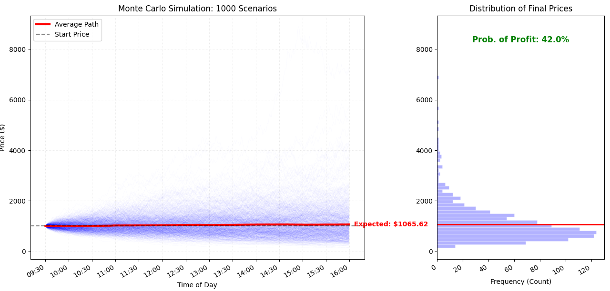

# Monte Carlo Stock Simulation
A Python tool for visualizing 1,000 "parallel universes" of a stock's price movement over a single trading day (390 minutes).

I built this to explore how **Volatility** and **Drift** interact. Even with a positive price trend, high volatility can lead to a surprisingly low Probability of Profit.

### How it Works
The simulation uses a random walk model where:
- **Price(t+1) = Price(t) * (1 + change + drift)**
- **Drift:** The underlying upward or downward "engine" of the stock.
- **Volatility:** The "chaos" or range of random movement each minute.

### Key Features
* **Live Dashboard:** Displays a price path "cloud" alongside a final price distribution histogram.
* **Probability of Profit (PoP):** Automatically calculates the statistical chance of ending the day in the green.
* **Risk Reporting:** Prints a summary of the Best Case, Worst Case, and Average scenarios to the console.

### Visual Results

*A typical run showing 1,000 scenarios with a red line representing the average expected path.*

### Setup
1. Clone this repo.
2. Install dependencies: `pip install numpy matplotlib`
3. Run the simulation: `python random_walk.py`
